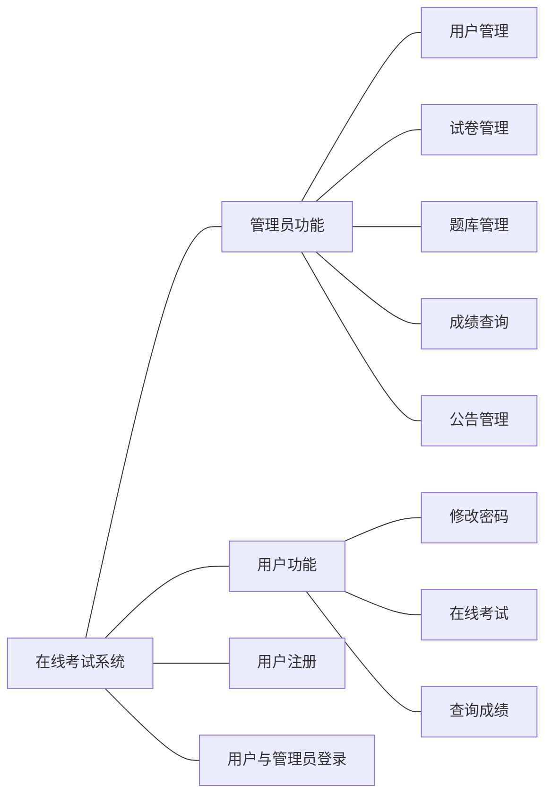
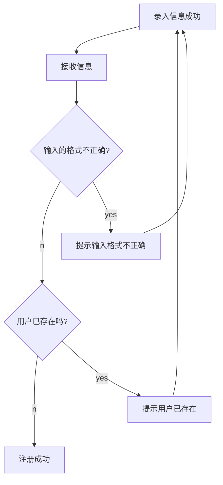
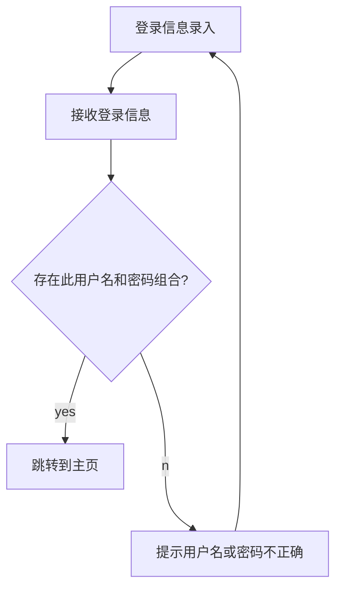

# 在线考试系统设计文档

## 目录

* [程序系统结构](#程序系统结构)

* [用户注册（user-zc）模块](#用户注册（user-zc）模块)

* [用户登录（login）模块](#用户登录（login）模块)

* [在线考试（onlineExam）模块](#在线考试（onlineExam）模块)

* [题库管理（question-gl）模块](#题库管理（question-gl）模块)

* [试卷管理（paper-gl）模块](#试卷管理（paper-gl）模块)

* [公告管理（notice-gl）模块](#公告管理（notice-gl）模块)

* [用户管理管理（user-gl）模块](#用户管理管理（user-gl）模块)

* [成绩查询（mark-cx）模块](#成绩查询（mark-cx）模块)

* [修改密码（pwd-xg）模块](#修改密码（pwd-xg）模块)

---

### 程序系统结构



---

### 用户注册（user-zc）模块



---

### 用户登录（login）模块



---

### 在线考试（onlineExam）模块

```mermaid
    flowchat

    st=> start:开始
    en=> end:结束

    st->en

```
